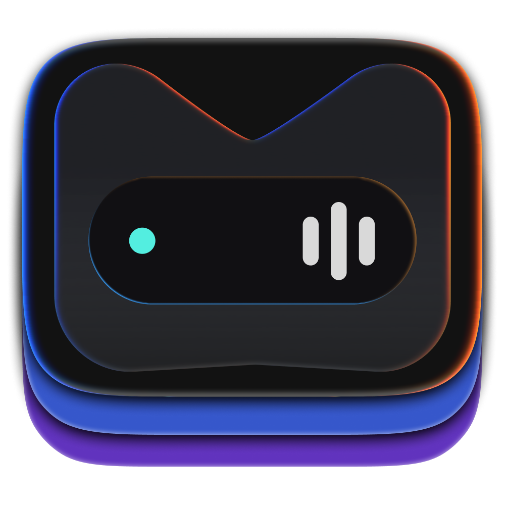

<div align="center">
  

# MiaDock

**A native, modular Dynamic Island-style dock for Windows 11.**

[](#requirements)
[](https://learn.microsoft.com/windows/apps/winui/winui3/)
[](https://dotnet.microsoft.com/)
[](https://github.com/mymiamo/MiaDock/actions/workflows/dotnet.yml)
[](LICENSE)

[Version **1.1.1.0** · Pre-release](https://github.com/mymiamo/MiaDock/releases)
</div>

## Overview

MiaDock is a lightweight, always-on-top Windows 11 overlay built with C#, .NET, WinUI 3, XAML, and the Windows App SDK. It stays outside the desktop work area, avoids stealing keyboard focus during normal use, and presents system events through compact, hover, expanded, and temporary notification states.

The application works locally without an account, server connection, telemetry, or a custom updater. Updates will be distributed through Microsoft Store after the public release.

## Features

- Windows media session discovery, artwork, timeline, seek, playback controls, and source selection
- Media-responsive audio activity indicator with a fallback animation
- Battery, network, Bluetooth, microphone, speaker, and inferred call activity
- Timer and stopwatch tools with persistent state and timer alarm
- Opt-in Windows notification listener with privacy controls
- Versioned named-pipe API for transfer progress providers
- Multi-monitor positioning, per-monitor DPI handling, and fullscreen behavior
- System tray controls, optional global shortcuts, startup task, and onboarding
- Turkish and English interface
- Apple-like, Mica, Mica Alt, Acrylic, Acrylic Thin, transparent blurred glass, and custom solid-color themes

## Requirements

- Windows 11, build 22000 or later
- x64 processor
- [.NET 10 SDK](https://dotnet.microsoft.com/download/dotnet/10.0) (`global.json` selects 10.0.301 or a later patch)
- Windows 11 SDK 10.0.26100.0 for development

## Build and run

```powershell
git clone https://github.com/mymiamo/MiaDock.git
cd MiaDock
dotnet restore MiaDock.sln
dotnet run --project src/MiaDock.App/MiaDock.App.csproj -c Debug -p:Platform=x64
```

Build without starting the application:

```powershell
dotnet build src/MiaDock.App/MiaDock.App.csproj -c Debug -p:Platform=x64
```

## Tests

```powershell
dotnet test tests/MiaDock.Core.Tests/MiaDock.Core.Tests.csproj -c Release
dotnet test tests/MiaDock.Platform.Windows.Tests/MiaDock.Platform.Windows.Tests.csproj -c Release -p:Platform=x64
dotnet test tests/MiaDock.WinUI.Tests/MiaDock.WinUI.Tests.csproj -c Release -p:Platform=x64
```

Optional long-running stability tests are gated by `MIADOCK_SOAK_PROFILE` and `MIADOCK_SOAK_SCALE`.

## Project structure

```text
src/
  MiaDock.App/                 WinUI windows, controls, settings, and composition
  MiaDock.Core/                Module contracts, state machine, settings, and logging
  MiaDock.Platform.Windows/    Win32 and Windows API integrations
  MiaDock.Modules.*/           Media, device, time, notification, and transfer modules
  MiaDock.UI/                  Shared presentation and theme resources
tests/                         Core, Windows platform, and WinUI resource tests
```

## Microsoft Store package

Create the local x64 Store upload package with:

```powershell
dotnet build src/MiaDock.App/MiaDock.App.csproj -c Release -p:Platform=x64 -p:BuildMsix=true
```

Generated Store packages, symbols, certificates, logs, and build output are intentionally excluded from Git. Do not commit files from `AppPackages/`.

## Contributing

1. Fork the repository.
2. Create a focused branch, for example `feature/timer-accessibility`.
3. Build the app and run all three test projects.
4. Open a pull request describing the behavior change and testing performed.
5. Include screenshots for visible UI changes and link related issues when applicable.

Please do not commit local settings, logs, exported diagnostics, certificates, MSIX packages, or generated build directories.

## Privacy and security

MiaDock stores settings and technical logs locally. Logs are designed to exclude media history, notification content, Bluetooth device names, personal file paths, and transfer names. Notification access is requested only after the user enables the module.

Report security-sensitive issues privately to the maintainer rather than posting exploitable details in a public issue.

## License

Copyright © Eray Durupınar.

MiaDock is licensed under the [GNU Affero General Public License v3.0](LICENSE).
